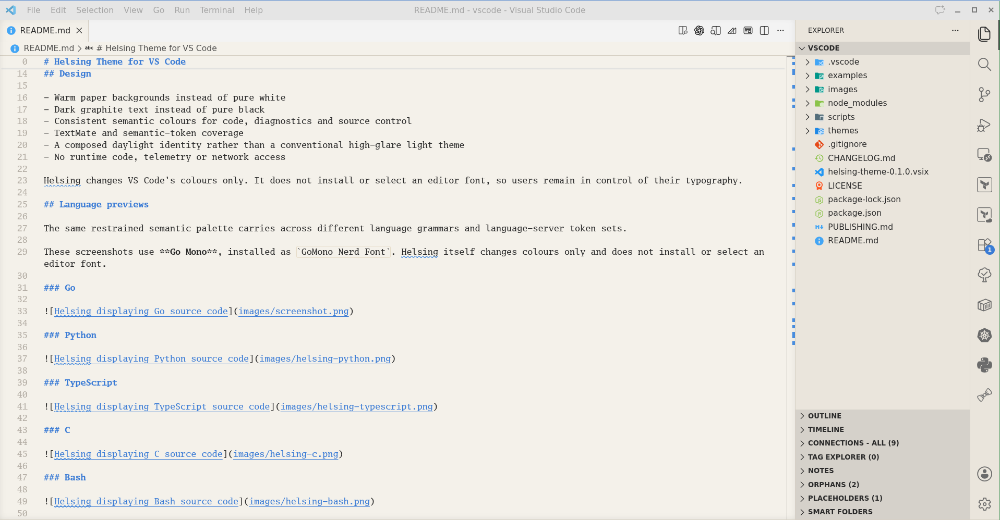

# Helsing Theme

_**Every famous vampire eventually needs a Van Helsing.**_

Helsing is a disciplined light theme built around paper warmth, restrained
accents and stable semantic colour roles.

Named for **Abraham Van Helsing**, the scholar, physician and adversary of
Dracula, conceived as the spiritual daylight counter that
[Dracula Theme](https://draculatheme.com/) always needed: less crypt, more
study.



Helsing is designed to remain pleasant during long working sessions. Structure
comes from measured contrast, and colour is used to communicate meaning rather
than decorate every token. The result is a theme with an old-world scholarly
character and a modern, workmanlike interface.

> [!Note]
>
> Helsing is an independent theme, **not** a fork, port or official Dracula
> companion, nor in any way associated with the Dracula Theme project, apart
> from the reference.

## Contributing

Helsing is meant to travel. Contributions that bring the theme to more editors, terminals, browsers, desktop environments, operating systems and other applications are welcome. Contributions to improve an existing Helsing theme are welcome too.

Before starting a new port, open an issue in the [Helsing issue tracker](https://github.com/caffeinated-minds/helsing/issues) so we can confirm the target, avoid duplicated work and discuss any platform constraints.

A new port should:

- Treat the [canonical palette](docs/helsing-palette.yml) and [theme specification](docs/helsing-theme-spec.md) as its source of truth.
- Preserve Helsing's semantic colour roles rather than matching colours approximately by eye.
- Include installation instructions and at least one representative screenshot.
- Document any unavoidable differences imposed by the target application.
- Be tested in the application it supports.

Experience with the target application matters more than familiarity with this repository. If you use a system or tool that Helsing does not support yet, you are invited to help give it a proper home there.

## Development

The [canonical palette](docs/helsing-palette.yml) is the source of truth. Target-specific helpers and mappings live under `generator/config/` and `generator/templates/`; files under `themes/` are generated release artefacts unless their target documentation says otherwise.

After changing a generated theme, regenerate the affected target and run the repository validation:

```bash
python generator/generate.py neovim
./checks/validate.sh
```

Use `python generator/generate.py --check` when you only want to verify that every generated target is current. Generated files should be committed with the template or configuration change that produced them.

## License

Helsing is available under the [MIT License](LICENSE).
