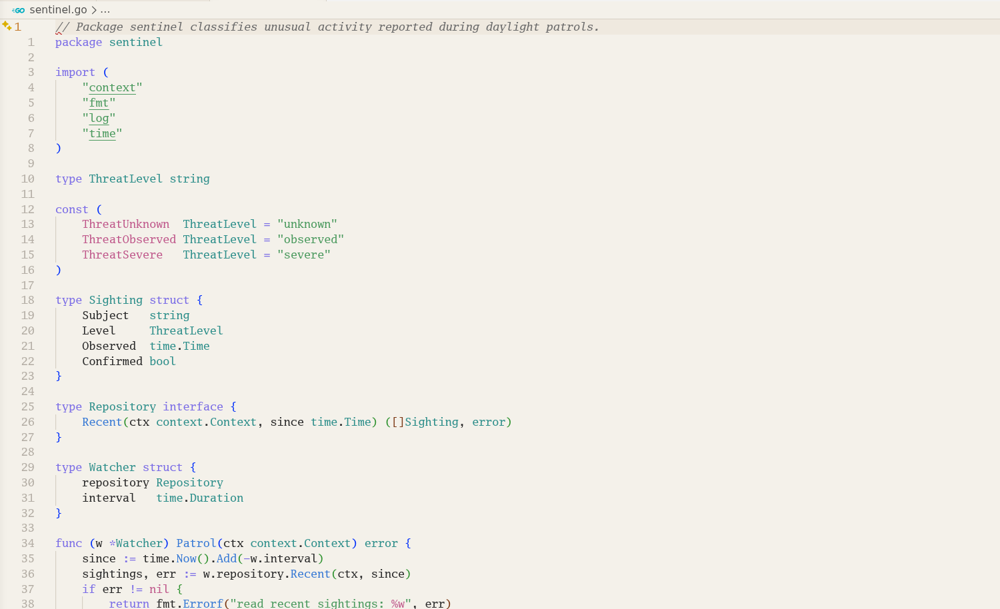
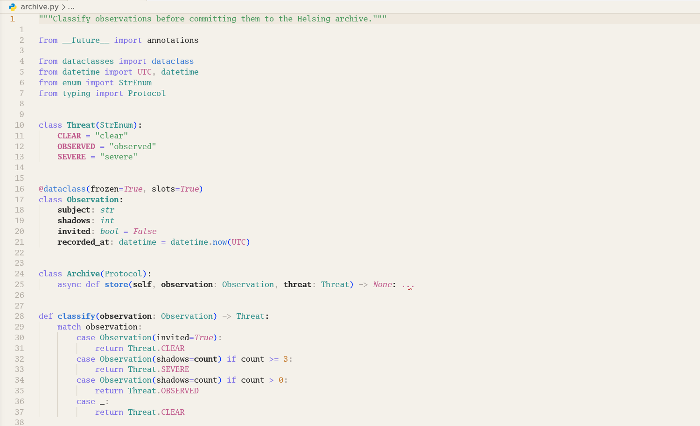
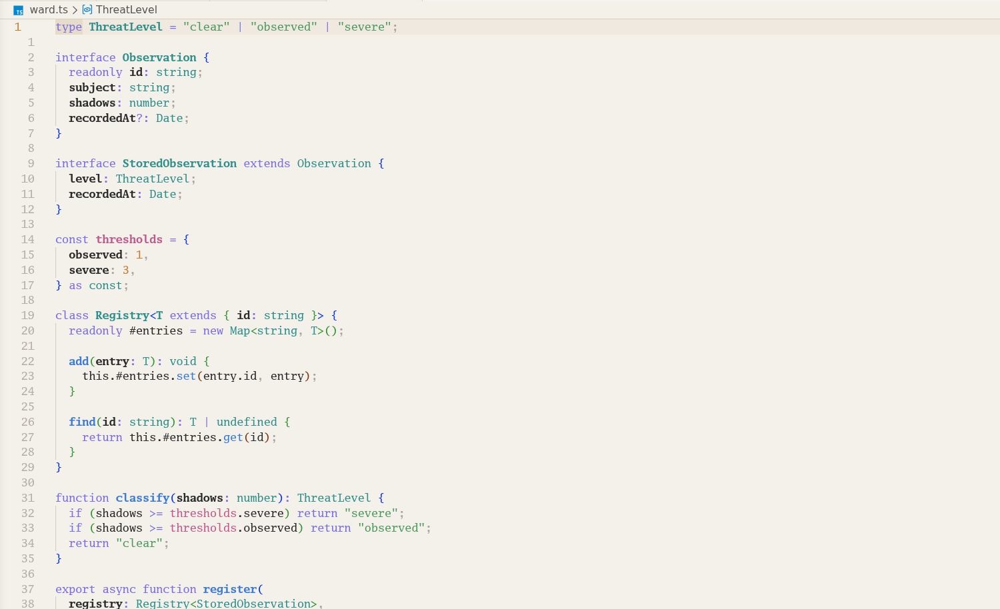
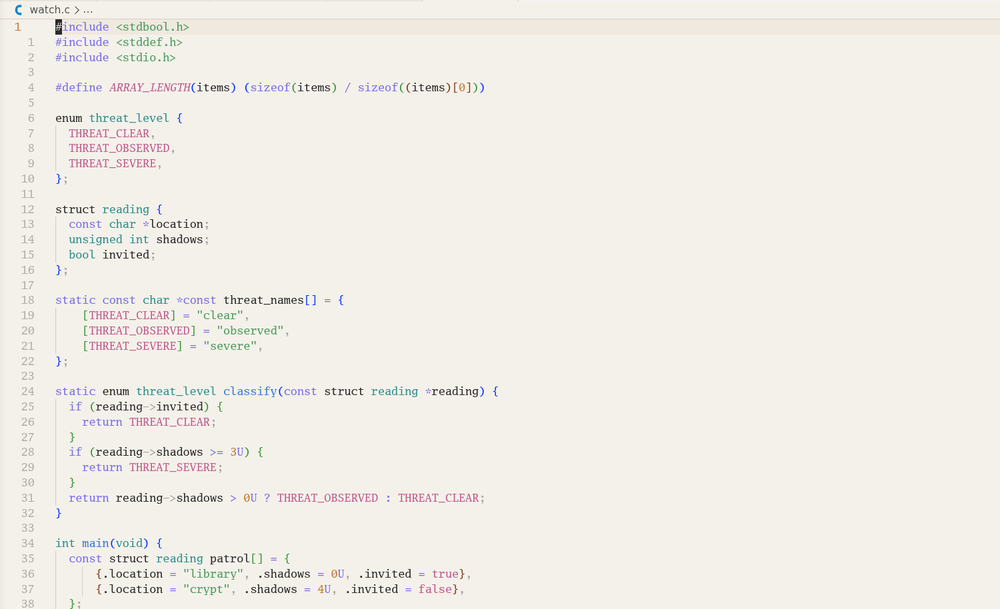
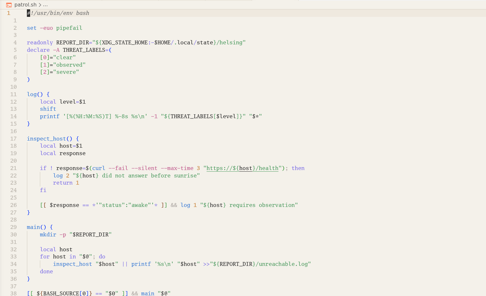
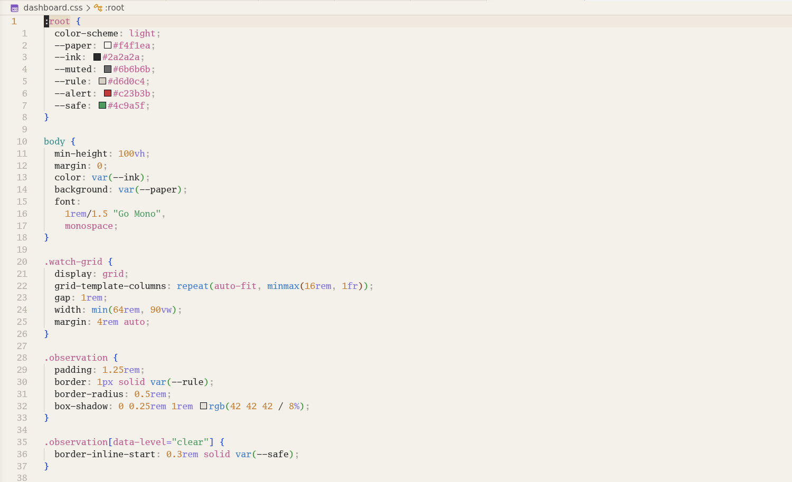
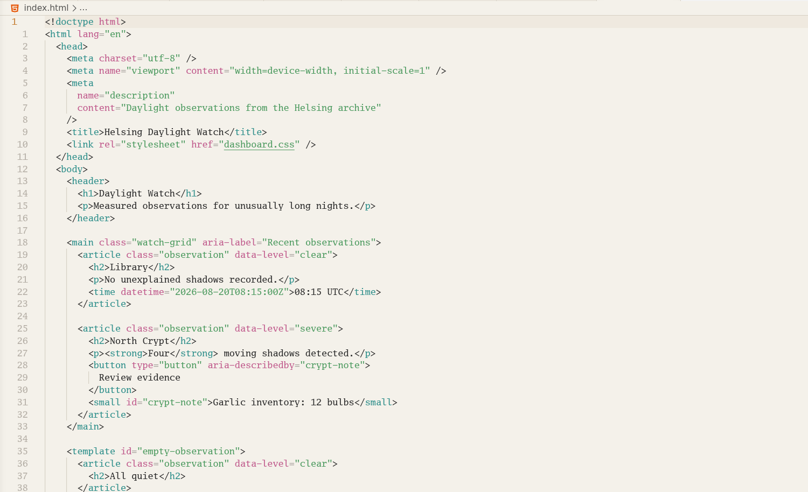

# Helsing Theme for VS Code

_**Every famous vampire eventually needs a Van Helsing.**_

Helsing is a disciplined light theme built around paper warmth, restrained
accents and stable semantic colour roles.

Named for **Abraham Van Helsing**, the scholar, physician and adversary of
Dracula, conceived as the spiritual daylight counter that
[Dracula Theme](https://draculatheme.com/) always needed: less crypt, more
study.


Helsing is designed to remain pleasant during long working sessions. Structure
comes from measured contrast, and colour is used to communicate meaning rather
than decorate every token. The result is a theme with an old-world scholarly
character and a modern, workmanlike interface.

> [!Note]
>
> Helsing is an independent theme, **not** a fork, port or official Dracula
> companion, nor in any way associated with the Dracula Theme project, apart
> from the reference.

## Design

- Warm paper backgrounds instead of pure white
- Dark graphite text instead of pure black
- Consistent semantic colours for code, diagnostics and source control
- TextMate and semantic-token coverage
- A composed daylight identity rather than a conventional high-glare light theme
- No runtime code, telemetry or network access

Helsing changes VS Code's colours only. It does not install or select an editor
font, so users remain in control of their typography.

## Language previews

The same restrained semantic palette carries across different language grammars
and language-server token sets.

> The following screenshots use **Go Mono**, installed as `GoMono Nerd Font`.

### Go



### Python



### TypeScript



### C



### Bash



### CSS



### HTML



## Install and activate

After installing the extension:

1. Open the Command Palette with `Ctrl+Shift+P` or `Cmd+Shift+P`.
2. Run **Preferences: Color Theme**.
3. Select **Helsing**.

## Feedback

Report inconsistent colours or missing language coverage through the
[Helsing issue tracker](https://github.com/caffeinated-minds/helsing/issues).
When reporting syntax highlighting, include the language, the relevant source
sample and a screenshot.

## Development

The published theme is generated from Helsing's palette contract rather than
edited directly:

- Palette: `docs/helsing-palette.yml`
- VS Code mapping: `generator/config/vscode.yml`
- Template: `generator/templates/vscode/helsing-color-theme.json.j2`
- Generated payload: `themes/vscode/themes/helsing-color-theme.json`

Open this directory as the VS Code workspace and press `F5` to launch the **Run
Helsing Theme** Extension Development Host configuration.

To regenerate and package from this directory:

```bash
npm ci
npm run theme:generate
npm run package:vsix
```

## License

Helsing Theme is available under the [MIT License](LICENSE).
