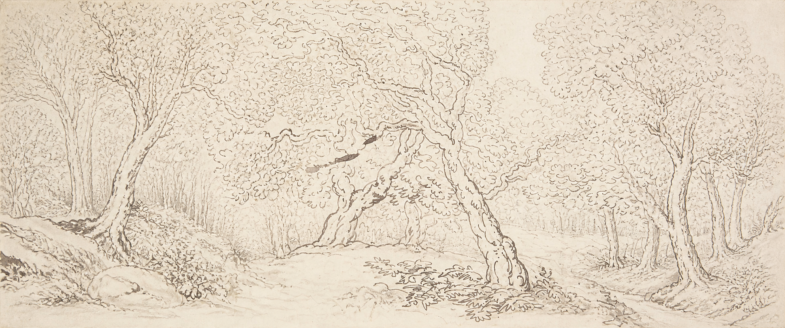

# Helsing Woodland



A quiet ink woodland on warm parchment, designed to accompany Helsing’s light surfaces. This is an AI-assisted adaptation of Thomas Rowlandson’s *Study of trees*, not an original Rowlandson work. Its continuous landscape fills the screen without a frame or side panels.

## Installation

Download `helsing-woodland.png` and select it in your desktop’s wallpaper settings. Choose **Fill** (centred crop), rather than stretch or fit.

For Sway, place the image at a stable local path and add this to your configuration, replacing the example path:

```sway
output * bg /absolute/path/to/helsing-woodland.png fill
```

Reload Sway with `swaymsg reload`. An existing theme include that sets `output * bg` must be updated too, or it may override your selection.

## Screens and resolution

The supplied PNG is 1938×811, approximately the same aspect ratio as 3440×1440. Fill mode scales it proportionally: ultrawide displays show almost the entire composition, while 1920×1080 displays retain approximately the central 74% of its width. Narrower displays crop more. The main leaning trees are kept centrally to accommodate this.

Displays larger than the source upscale the image; this is not a native 3440×1440 asset. The delicate illustration should be assessed at your actual display size. Its paper and ink include natural tonal variations inspired by Helsing, rather than an exact indexed palette.

## Source and attribution

- Reference: Thomas Rowlandson, *Study of trees*, 1780–1827, pen and brown ink.
- Collection: The Metropolitan Museum of Art, object 68.549.1.
- [Museum record and public-domain designation](https://www.metmuseum.org/art/collection/search/364025).
- [Reference image](https://collectionapi.metmuseum.org/api/collection/v1/iiif/364025/754149/main-image), preserved here as `rowlandson-study-of-trees-reference.jpg`.
- The reference is public domain. The AI-assisted adaptation is distributed under the repository’s [MIT licence](../../LICENSE), to the extent rights apply; that licence does not restrict the public-domain source.
- Created with OpenAI’s built-in image generation tool. The frame was removed and the woodland extended into a panoramic composition. See [generation notes](generation.md).
